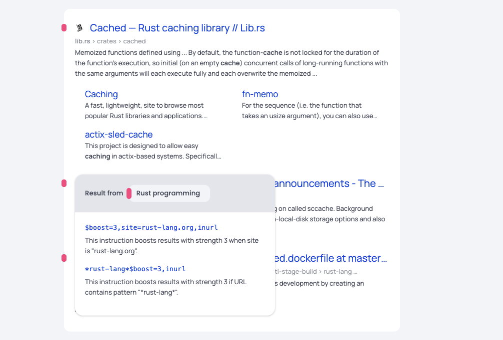

# Getting Started

## Goggles syntax

Goggles are simple, self-contained text files which can be hosted in Github or
Gitlab. These files contain instructions allowing you to tell Brave Search how
you'd like your results to be ranked. You can target specific URL patterns
(and, soon, website titles and other aspects of Web pages) and indicate how
their ranking should be altered (e.g. boosted, downranked, or completely
discarded from the results).

Individually, each instruction can either target a very narrow set of pages (or
even a single page), or a wider range of them, to apply reranking to a bigger
set of results. In combination, hundreds or more instructions can allow you to
express complex reranking functions.

Although the Goggles language could express instructions to search through a
small set of websites or act as a blocklist, Goggles really shine when used to
express boosting and downranking across many domains and pages.

For an introduction to the syntax of Goggles, check out our [Goggles quickstart guide](./goggles/quickstart.goggle).

## Creating a Goggle

First, get familiar with the Goggles DSL (Domain Specific Language), which will
allow you to express reranking instructions. We recommend that you follow the
introduction in our [Goggles quickstart guide](./goggles/quickstart.goggle).

The next step is to create your Goggle (a plain text file) and then upload it
to one of the supported hosting platforms:

* https://gist.github.com/ (both public and secret gists are supported)
* https://github.com/ (public files)
* https://gitlab.com/ (both public files and “snippets” are supported)

Do not forget to add the necessary metadata at the top of your new Goggle:

```
! name: My Goggle
! description: What my Goggle does
! public: false
! author: Me
```

Additionally, you can specify the following optional metadata attributes:

* homepage — specifies a homepage URL displayed on your Goggle's profile.
* issues — specifies a URL where users can report issues for your Goggle.
* transferred_to — Allows to transfer ownership of a Goggle.
* avatar —  specifies a *valid* HEX color code for your Goggle.
* license — specifies the license of a Goggle's instructions.

Note that the `public` attribute, when set to value `true`, indicates that your
Goggle can be discovered by other Brave Search users via the search feature on
https://search.brave.com/goggles/discover. A `private` Goggle can still be used
by anyone who knows the URL where it is hosted, but cannot be found through the
discovery page.

Once you have hosted your rules, you can submit the URL on
https://search.brave.com/goggles/create. Brave Search will then fetch, validate
and cache your Goggle internally so that it can be used while searching. In
case the Goggle cannot be fetched, or is not valid, you will get some feedback
in the page.

Examples of valid Goggle URLs:
* https://gist.github.com/remusao/fca3f9ee3ddca3e022426b8237e838ac
* https://gist.githubusercontent.com/remusao/fca3f9ee3ddca3e022426b8237e838ac/raw/290bd654ff10472545cc0ba742a875a26daccfa2/tech_blogs.goggles
* https://gitlab.com/-/snippets/2357408
* https://gitlab.com/-/snippets/2357408/raw
* https://gitlab.com/aurelius.marcus/test/-/raw/main/tech_blogs.goggle
* https://raw.githubusercontent.com/brave/goggles-quickstart/main/goggles/tech_blogs.goggle

There are currently a few limitations imposed on the Goggle files submitted to
Brave Search, in order to guarantee reasonable performance and prevent abuse.
We believe these limits are safeguards which should not impair the ability to
express complex reranking functions:

* The size of a Goggle file cannot exceed 2MB
* The number of instructions in a Goggle file cannot exceed 100,000
* The length of an instruction cannot exceed 500 characters
* The number of `*` characters (wildcard) in a single instruction cannot exceed 2
* The number of `^` characters (caret) in a single instruction cannot exceed 2

## Updating a Goggle

To update a Goggle, you must resubmit the Goggle URL in
https://search.brave.com/goggles/create. This will trigger a re-fetch of the
updated Goggle source, and then make it available on Brave Search. 

It’s important to know that Brave Search does not maintain a version history of
Goggles, which means the author is solely responsible for the content of their
Goggles.

## Deleting a Goggle

Brave only keeps a reference of the original Goggle file when provided with a
link to the original source. This means that to delete a Goggle, it first needs
to be deleted upstream, at the original URL where the Goggle was hosted. Once
that happens, to trigger a delete on demand in Brave Search, submit the Goggle
URL in https://search.brave.com/goggles/create.

## Learn by example

We believe it’s best to learn by example—this is why we created some Goggles
for the beta release, strictly for educational purposes, they are authored by
“Goggles 101” and hosted in this repository under the [goggles folder](./goggles).
Any Goggle not hosted by Brave is, of course, not affiliated with Brave in any
way.

These Goggles are best-effort and as-is. We will not actively maintain them, as
their sole purpose is to showcase some basic use-cases of what is possible with
Goggles.

We hope that soon the community will create much more sophisticated, accurate,
and useful Goggles so that we can deprecate these educational examples in favor
of community-owned ones.

 - [Tech blogs](./goggles/tech_blogs.goggle) — Rerank results to boost content on tech blogs. List of tech blogs drawn from several sources (blogsurf.io, refined.blog, et al), and not vetted or endorsed by Brave.
 - [Hacker News](./goggles/hacker_news.goggle) — Prioritizes domains popular with the Hacker News community, minus those that would rank among the top 1000 most-viewed websites.
 - [Rust programming](./goggles/rust_programming.goggle) — Rerank results to boost content related to the Rust programming language.
 - [No Pinterest](./goggles/no_pinterest.goggle) — Rerank results to remove pages / threads hosted on Pinterest.
 - [Copycats removal](./goggles/copycats_removal.goggle) — Rerank results to remove “copycat” content (e.g. StackOverflow threads or GitHub translations).
 - [1k short](./goggles/1k_short.goggle) — Rerank results to remove pages found on the top 1,000 most-viewed websites. List of top sites drawn from tranco-list.eu. Up-ranked sites not vetted or endorsed by Brave.
 - [Brave Community](./goggles/brave_community.goggle) — Rerank results to boost threads from the Brave community forums.

On the [Goggle discovery page](https://search.brave.com/goggles/discover) you will
probably see many more Goggles created by the community, you can learn from
those too. The instructions of the Goggle are by definition open.


## Fine-tuning a Goggle

Creating Goggles is simple. However, they often need some fine-tuning to shine.

The typical flow is to create the first set of instructions and then have a
test set to evaluate the effect it has on the ranking. You will probably see
some odd results and further instructions will be needed. Rinse and repeat is
the name of the game. 

To make this task a little less tedious, we provide some explanations on the
results that have been affected by the instructions in the Goggle.



This might help you in the process.


## Sharing a Goggle with the world

Any Goggle you create can either be `private` or `public`. 

If it is `private`, it will not be discoverable, and will only be accessible to
those who know the Goggle URL.

If `public`, a Goggle can be found either by URL or on the [discovery page](https://search.brave.com/goggles/discover).
People can search by keywords to discover new Goggles, and try them out if they
want. People can then follow a Goggle if they want to save it for future use
(followed Goggles are stored in the browser’s localStorage).

To indicate if your Goggle is `public` or `private`, you need to specify the
following metadata at the head of your Goggle file:

```
! public: true
```

Or,
```
! public: false
```

For more details about the mandatory and optional metadata attributes of
Goggles, please refer to the [Goggles quickstart
guide](./goggles/quickstart.goggle).

Certain Goggles that become very popular might end up being displayed on the
[discovery page’s](https://search.brave.com/goggles/discover) Popular Goggles section. For the beta launch, we’re only
displaying the educational Goggles.

However, the preferred option to discover Goggles is to find them directly from
the creator on their own channels. Sharing your Goggle is as simple as building
the following URL:

```
https://search.brave.com/goggles?goggles_id={YOUR_GOGGLE_URL}
```

Let us emphasize again that before being able to use a Goggle, it needs to have been submitted to https://search.brave.com/goggles/create

Note that `YOUR_GOGGLE_URL` should ideally be urlencoded as with:

```
https://search.brave.com/goggles?goggles_id=https%3A%2F%2Fgist.githubusercontent.com%2Fremusao%2Ffca3f9ee3ddca3e022426b8237e838ac%2Fraw%2F
```

Clicking that link will allow anyone to check your Goggle and follow it.

## What happens when two instructions are conflicting?

It is fairly easy to end up with conflicting instructions (i.e. multiple
instructions with different effects applying to the same results). These
conflicts can be either easy to spot, as with:

```
$boost=3,site=example.com
$boost=1,site=example.com
```

Or they can be more subtle, as with:

```
$downrank=3,site=example.com
/posts/$boost=3
```

In the above example, both would match on the URL `https://example.com/posts/hello.html`.

The precedence rule follows a simple principle: Goggles are meant to surface
more content. So a boosting rule will always take precedence over a downrank.

On the other hand, a ([non-generic](https://github.com/brave/goggles-quickstart/blob/main/getting-started.md#how-can-i-exclude-any-result-not-matched-by-my-goggle)) `discard` is final and will take precedence
over `boost` and `downrank`. So to summarize: `discard > boost > downrank`.
This means that `$discard` takes precedence over `$boost=3`, which takes
precedence over `$boost=2`, which takes precedence over `$downrank`, which
takes precedence over `$downrank=2`.

In the examples above, the URL `https://example.com/posts/hello.html` would be
boosted with strength 3.

## How can I exclude any result not matched by my Goggle?

By default, results not strictly discarded by your Goggle might still be
included in the final set of results if they’re very relevant to the query
(although matched results will always be boosted according to your
instructions). If you’d like to exclude any result that is not explicitly
matched by any instruction in your Goggle, you can change the “default action”
by adding a generic `$discard` rule. Consider the following:

```
$discard
$boost,site=en.wikipedia.org
$boost,site=de.wikipedia.org
```

The above example would exclude any result which does not have either
`en.wikipedia.org` or `de.wikipedia.org` as a hostname. Whereas by default
these results would only be boosted and mixed with other results.
